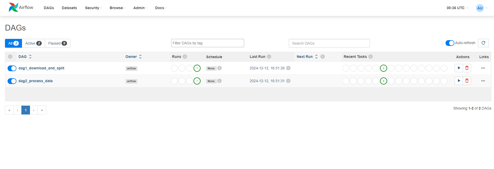

# Airflow Pobieranie i Przetwarzanie Danych

## Opis projektu

Ten projekt zawiera dwa DAG-i stworzone w Apache Airflow do przetwarzania danych. Workflow zostały przygotowane, aby pobierać dane, dzielić je, przetwarzać, a następnie zapisywać w arkuszach Google Sheets.

### **DAG 1: Download and Split Data**

**Opis:**
- Pobiera dane z zewnętrznego źródła (plik CSV).
- Dzieli dane na dwie części:
  - **Model Dataset** (70%)
  - **Retrain Dataset** (30%).
- Zapisuje te dane w osobnych arkuszach Google Sheets.

**Kroki:**
1. Pobranie danych z podanego URL.
2. Podział danych przy użyciu `train_test_split`.
3. Zapis danych do arkuszy Google Sheets.

**Kod DAG-a:**
[Link do kodu DAG 1](https://github.com/<username>/<repo-name>/blob/main/dags/dag1_download_and_split.py)

---

### **DAG 2: Process Data**

**Opis:**
- Pobiera dane z arkusza Google Sheets (**Model Dataset**).
- Czyści dane (usunięcie braków i duplikatów).
- Skalowanie i normalizacja danych.
- Zapisuje przetworzone dane w nowym arkuszu Google Sheets (**Processed Dataset**).

**Kroki:**
1. Pobranie danych z Google Sheets.
2. Czyszczenie danych (usuwanie braków i duplikatów).
3. Skalowanie i normalizacja danych przy użyciu `StandardScaler` i `MinMaxScaler`.
4. Zapis danych do nowego arkusza Google Sheets.

**Kod DAG-a:**
[Link do kodu DAG 2](https://github.com/<username>/<repo-name>/blob/main/dags/dag2_process_data.py)

---

## Wyniki działania

### Linki do DAG-ów
- [DAG 1: Download and Split Data](https://github.com/<username>/<repo-name>/blob/main/dags/dag1_download_and_split.py)
- [DAG 2: Process Data](https://github.com/<username>/<repo-name>/blob/main/dags/dag2_process_data.py)

### Zrzuty ekranu

#### 1. Widok działania workflow w GitHub Actions



---

## Jak uruchomić projekt

### Przy użyciu GitHub Actions

1. Przejdź do zakładki **Actions** w repozytorium.
2. Wybierz workflow **Run Airflow DAGs**.
3. Kliknij przycisk **Run workflow** i poczekaj na zakończenie wszystkich kroków.

Workflow automatycznie:
- Uruchomi kontener z Apache Airflow.
- Wywoła oba DAG-i.
- Przetworzy dane i zapisze je w Google Sheets.

### Ręczne uruchomienie lokalne

1. Uruchom środowisko Docker przy użyciu `docker-compose.yml`:
   ```bash
   docker-compose up
   ```
2. Wejdź na [http://localhost:8080](http://localhost:8080).
3. Zaloguj się do Apache Airflow (domyślnie: **admin/admin**).
4. Uruchom DAG-i ręcznie z poziomu interfejsu użytkownika.

---

## Testowanie

- Oba DAG-i zostały przetestowane w środowisku GitHub Actions oraz lokalnie.
- Logi z działania są dostępne w zakładce **Actions** w repozytorium.

---

## Uwagi dodatkowe

- Wszystkie operacje na arkuszach Google Sheets wymagają poprawnej konfiguracji klucza JSON do autoryzacji konta usługi.
- Linki do wygenerowanych arkuszy Google Sheets powinny być załączone jako dowód działania.

